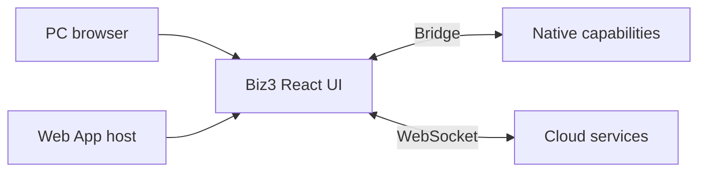
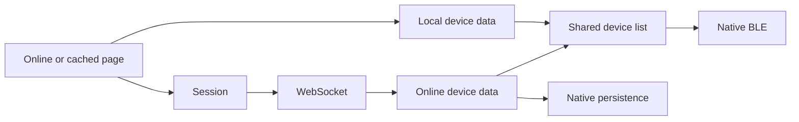

# Biz3

[日本語](README.md) | [简体中文](README_zh-CN.md) | [English](README_en.md)

Biz3 は PC 管理画面と Web App の業務画面を提供する React プロジェクトです。Web App は bridge を通じてホストの Bluetooth・OS 機能を利用します。

**Biz は業務ロジック、Web App ホストはネイティブ機能、Bridge は通信を担当します。**



## 開発

Node.js 20（`.nvmrc`）、Yarn 1.x。配信用ビルド：`yarn build`。

```bash
nvm use
yarn install --frozen-lockfile
yarn dev
```

通常のブラウザーは PC モードです。App 画面のプレビュー：`http://localhost:3000/?appHome=1&fromType=app`。BLE・QR スキャン・NFC は Web App ホストで検証します。

## 環境

APP の起動ページはページ URL の設定で指定します。ページ URL と Biz のクラウド接続先は独立した設定です。

- [本番](https://biz.candyhouse.co/)

クラウド接続設定は `src/env_config.js` と `src/aws-exports.js` を参照してください。現在の `env_config.js` は production を選択しています。配信ブランチやページ URL だけではこれらの設定は切り替わりません。ページのドメイン変更時は bridge の信頼元と CORS も合わせて設定します。新ドメインの初回読み込みには通信が必要です。

## 起動とキャッシュ



ホーム画面は bridge 経由でローカルデバイスを先に取得し、ローカルとオンラインのデータを同じ一覧で表示します。オンライン一覧をすべて取得した後に画面を更新し、ホストへ渡してローカルに保存します。完全な鍵では BLE 操作が可能です。クラウド操作、登録、制限付き鍵の署名には通信が必要です。

ゲストは Cognito 匿名資格情報で `POST /web_route` に署名し、セッショントークンを取得してから WebSocket に接続します。

ページキャッシュは Web App ホスト内で Service Worker が利用可能な場合にのみ登録します。実装は `src/services/appPageCache.js` を参照してください。HTTPS または localhost などの安全なコンテキストを使用します。通常の PC ブラウザーや `appHome=1` のみを付けたプレビューでは登録を開始しません。保存対象は公開ページ資源のみで、API 応答・token・鍵は含みません。HTML はネットワーク優先で読み込み、必要な資源の保存後にオフライン入口を更新します。オフラインでは保存済みページを利用します。初回利用・ドメイン変更・キャッシュ削除後はオンラインでの読み込みが必要です。

## コード構成

| Path | Responsibility |
| --- | --- |
| src/components/AppBootstrap.js | Session startup + offline fallback |
| src/components/AppHomeRuntime.js | Cloud/BLE events, key handoff, navigation |
| src/components/AppOfflineDevices.js | Local data + shared device list + BLE |
| src/services/appBridge.js | Trusted native MessagePort requests |
| src/services/appSession.js | Web/legacy/guest session selection |
| src/services/appOperations.js | Existing socket app-operation adapter |
| src/services/deviceService.js + src/services/blePresentation.js | App mode, native device events and shared BLE status presentation |
| src/services/appPageCache.js + public/app-worker.js | Automatic public page cache |
| src/components/BackButton.js | Shared PC and Web App back button |
| src/api + src/websocket | Existing business requests and socket lifecycle |
| src/i18n | ja / en / zh-CN / zh-TW UI strings |
