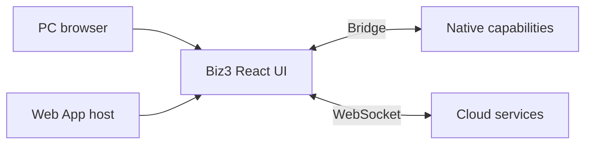
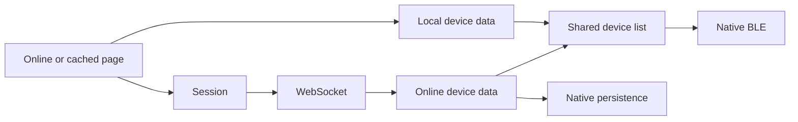

# Biz3

[日本語](README.md) | [简体中文](README_zh-CN.md) | [English](README_en.md)

Biz3 is a React project providing the PC management console and Web App UI. The Web App uses a bridge to access native Bluetooth and platform capabilities.

**Biz owns business logic, the Web App host provides native capabilities, and Bridge handles communication.**



## Development

Node.js 20 (`.nvmrc`), Yarn 1.x. Production build: `yarn build`.

```bash
nvm use
yarn install --frozen-lockfile
yarn dev
```

Browsers default to PC mode. App preview: `http://localhost:3000/?appHome=1&fromType=app`. Validate BLE, QR scanning and NFC in the Web App host.

## Environments

The APP entry point is set through its page URL configuration. The page URL and Biz cloud endpoints are separate settings.

- [Production](https://biz.candyhouse.co/)

Cloud connection settings are in `src/env_config.js` and `src/aws-exports.js`. The current `env_config.js` selects production. Deployment branches and page URLs do not automatically change these settings. A page-origin change also requires matching bridge trust and CORS settings; the new origin needs an initial online load.

## Startup and caching



The home page reads local devices through the bridge first. Local and online data use the same device list. A complete online list updates the UI and is passed to the host for local persistence. Full keys support local BLE operation; cloud actions, registration and restricted-key signing require connectivity.

Guests sign `POST /web_route` with Cognito unauthenticated credentials to obtain a session token before connecting to WebSocket.

The page cache is registered only in the Web App host when Service Worker support is available; see `src/services/appPageCache.js`. Use a secure context such as HTTPS or localhost. Regular PC browsers and previews using only `appHome=1` do not initiate registration. Only public page assets are cached, excluding API responses, tokens and keys. HTML is network-first; the offline entry is updated after its assets are stored. Offline starts use the cached page. First use, an origin change or cleared cache requires an online load.

## Code entry points

| Path | Responsibility |
| --- | --- |
| src/components/AppBootstrap.js | Session startup + offline fallback |
| src/components/AppHomeRuntime.js | Cloud/BLE events, key handoff, navigation |
| src/components/AppOfflineDevices.js | Local data + shared device list + BLE |
| src/services/appBridge.js | Trusted native MessagePort requests |
| src/services/appSession.js | Web/legacy/guest session selection |
| src/services/appOperations.js | Existing socket app-operation adapter |
| src/services/deviceService.js + src/services/blePresentation.js | App mode, native device events and shared BLE status presentation |
| src/services/appPageCache.js + public/app-worker.js | Automatic public page cache |
| src/components/BackButton.js | Shared PC and Web App back button |
| src/api + src/websocket | Existing business requests and socket lifecycle |
| src/i18n | ja / en / zh-CN / zh-TW UI strings |
