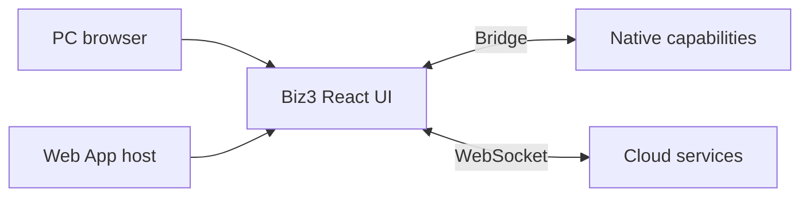
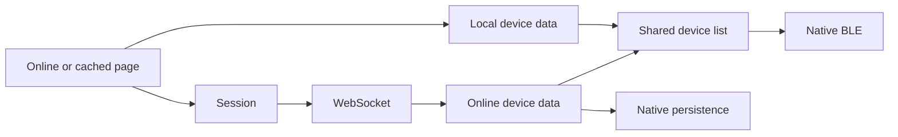

# Biz3

[日本語](README.md) | [简体中文](README_zh-CN.md) | [English](README_en.md)

Biz3 是提供 PC 管理页面和 Web App 业务界面的 React 项目。Web App 通过 bridge 调用宿主的蓝牙及系统能力。

**Biz 负责业务逻辑，Web App 宿主负责原生能力，Bridge 负责通信。**



## 开发

Node.js 20（`.nvmrc`）、Yarn 1.x。发布构建：`yarn build`。

```bash
nvm use
yarn install --frozen-lockfile
yarn dev
```

普通浏览器默认使用 PC 模式；App 页面预览：`http://localhost:3000/?appHome=1&fromType=app`。BLE、扫码及 NFC 需在 Web App 宿主中验证。

## 环境

APP 通过页面地址配置指定入口。页面入口与 Biz 云端服务配置相互独立。

- [正式](https://biz.candyhouse.co/)

云端连接配置见 `src/env_config.js` 和 `src/aws-exports.js`。当前 `env_config.js` 选择 production；部署分支或页面 URL 不会自动切换这些配置。切换页面域名时需同步配置 bridge 信任来源与 CORS；新域名首次使用需要联网加载页面。

## 启动与缓存



首页优先通过 bridge 读取本地设备，使用同一套列表展示本地和线上数据。线上完整列表到达后更新界面，并通知宿主更新本地数据。完整钥匙支持本地 BLE 操作；云端操作、注册和受限钥匙签名需要网络。

游客通过 Cognito 匿名凭证签名 `POST /web_route`，获取会话 token 后建立 WebSocket。

页面缓存仅在 Web App 宿主且浏览器支持 Service Worker 时注册，见 `src/services/appPageCache.js`；使用 HTTPS 或 localhost 等安全上下文，普通 PC 浏览器和仅添加 `appHome=1` 的预览不会主动注册。缓存只保存公共页面资源，不包含 API 响应、token 或钥匙。HTML 优先从网络加载，资源保存成功后更新离线入口；断网时使用已缓存页面。首次使用、切换域名或清除缓存后，需要联网加载一次。

## 代码入口

| Path | Responsibility |
| --- | --- |
| src/components/AppBootstrap.js | Session startup + offline fallback |
| src/components/AppHomeRuntime.js | Cloud/BLE events, key handoff, navigation |
| src/components/AppOfflineDevices.js | Local data + shared device list + BLE |
| src/services/appBridge.js | Trusted native MessagePort requests |
| src/services/appSession.js | Web/legacy/guest session selection |
| src/services/appOperations.js | Existing socket app-operation adapter |
| src/services/deviceService.js + src/services/blePresentation.js | App mode, native device events and shared BLE status presentation |
| src/services/appPageCache.js + public/app-worker.js | Automatic public page cache |
| src/components/BackButton.js | Shared PC and Web App back button |
| src/api + src/websocket | Existing business requests and socket lifecycle |
| src/i18n | ja / en / zh-CN / zh-TW UI strings |
